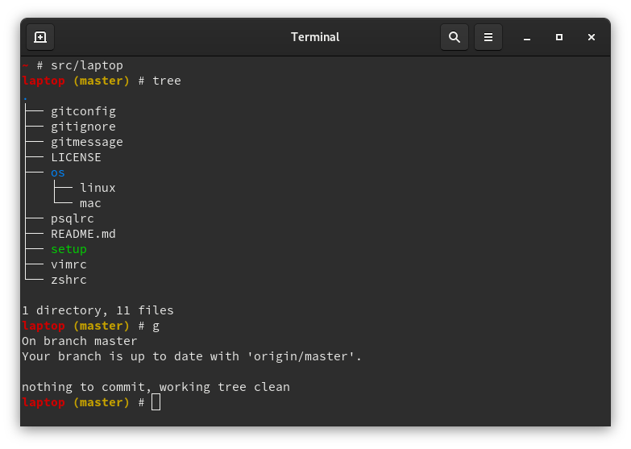

Shift3 Laptop Setup and Dotfiles
================================

[](https://circleci.com/gh/Shift3/laptop)

The scripts contained in this repo will setup your Mac, Ubuntu, Debian, or
Fedora computer with a base development environment, installing tools that we
find helpful and configuring them with sensible defaults. There are separate
instructions for configuring Windows found [here](https://github.com/Shift3/standards-and-practices#windows).

It also maintains your dotfiles and provides a way for you to customize them to
your liking if desired.

The `setup` script is designed to be run multiple times if necessary. It is
non-destructive, and will backup your previous dotfile setup if any exists.



Install
-------

You will need to keep the repo around somewhere safe, so let's make a folder for
it and clone the repo into it.

```sh
# Clone the repo (or download a zip file for a temporary setup)
cd
mkdir src && cd src
git clone git@github.com:Shift3/laptop.git
cd laptop

# run the setup script
./setup

# if prompted for your password at any point, please enter it, if asked any
# Y/N prompts, please hit Y <enter>
```

It should take around 5-10 minutes to install everything. After install, reboot
your computer to ensure that everything takes.

What it installs
----------------

macOS tools (if on mac):

* [Homebrew] package manager for mac

[Homebrew]: http://brew.sh/

Language tools:

* [nvm] for managing node version locally

[nvm]: https://github.com/nvm-sh/nvm

Unix tools:

* [Git] for version control
* [OpenSSL] for [Transport Layer Security (TLS)](https://en.wikipedia.org/wiki/Transport_Layer_Security)
* [The Silver Searcher] for finding things in files
* [Tmux] for saving project state and switching between projects
* [Watchman] for watching for filesystem events
* [Zsh] as your shell

[Git]: https://git-scm.com/
[OpenSSL]: https://www.openssl.org/
[The Silver Searcher]: https://github.com/ggreer/the_silver_searcher
[Tmux]: http://tmux.github.io/
[Watchman]: https://facebook.github.io/watchman/
[Zsh]: http://www.zsh.org/

Container tools:

* [Docker] for containerizing applications

[Docker]: https://www.docker.com/

GitHub tools:

* [Hub] for interacting with the GitHub API

[Hub]: http://hub.github.com/

Image tools:

* [ImageMagick] for cropping and resizing images

[ImageMagick]: https://imagemagick.org/index.php

What It Configures
------------------

Git:

* `g` typed alone is the same as `git status` and can be used as a replacement
  for `git`, so you can type any git command with `g` instead like: `g commit`.
* Sets up git commit to use a template encouraging you to write nice git commit
  messages.
* Some sensible defaults for fetch, rebase, merge, and push.
* Sets up some handy aliases, notable aliases are:

| Alias         | Description                                         |
| ------------- |:--------------------------------------------------: |
| `g aa`        | git add all unstaged files                          |
| `g c`         | Commit (brings up EDITOR)                           |
| `g ca`        | Amend last commit                                   |
| `g co`        | Checkout                                            |
| `g d`         | Diff                                                |
| `g fup`       | Fetch and rebase branch against develop             |
| `g lg`        | A prettier and nicer git log                        |
| `g branches`  | Pretty list of branches                             |
| `g who`       | List of people who are major committers on the repo |

Zsh:

* Sets a nice pretty prompt, whenever you `cd` into a directory with git displays
  the git branch in the prompt.
* Setup autocompletion.
* Uses some `cd` movement options of zsh, you can type the directory names instead
  of prefixing them with `cd` making movement easier.
* Enables some extended features making zsh nicer.
* Setup `PATH` to function with some of the OS packages we installed earlier,
  nvm, yarn, homebrew (if on mac), `~/bin` (if exists).
* Set default terminal editor to vim.

Psql:

* `psql` console does not wrap records in an ugly way now if the line is too long,
  it chooses the best layout based on how long the row is.
* Keeps history so if you close console and come back in you can still press up
  to view your command history.

Vim:

* A stripped down version of my default vim setup, should be a bit nicer for
  people just getting into vim.
* Has some basic vim plugins that make things functional. See the file for more
  details, it's decently commented.

Maintaining your customizations
-------------------------------

You may choose 1 of 2 options. Either you can fork this repo and make your
changes directly to the dotfiles inside, or you can use the built-in
extensibility, each dotfile calls out to another dotfile extension if it
exists. For example if `~/.zshrc.user` exists, it will be called and your extra
configurations for zsh will be executed from there. Customizations are handled in the same way for
`~/.gitconfig.user`.

A recommended `~/.gitconfig.user` is as follows:

```ini
[user]
  name = Justin Schiff
  email = jschiff@shift3tech.com
```

You can customize your zsh as desired in `~/.zshrc.user`:

```sh
# override the default prompt if you want :)
# this one is really basic, don't use this one.
export PS1='>:) '

# any other regular zshrc customization personal to you
alias copy=pbcopy
alias paste=pbpaste

# etc.
```

You can customize your vim plugins in the `~/.vimrc.plug.user` file:

```vim
" Rails Plugins
Plug 'tpope/vim-bundler'
Plug 'tpope/vim-endwise'
Plug 'tpope/vim-eunuch'
Plug 'tpope/vim-rails'
Plug 'tpope/vim-rake'
Plug 'tpope/vim-repeat'
```

You can customize your vim itself in `~/.vimrc.user`:

```vim
if has("gui_running")
  set guifont=Source\ Code\ Pro\ 11
endif
```

Additional setup instructions can be provided from `~/.laptop.user`

```bash
#!/bin/bash

# Install rbenv
if [ ! -d ~/.rbenv ]; then
  git clone https://github.com/rbenv/rbenv.git ~/.rbenv
  cd ~/.rbenv && src/configure && make -C src
  git clone https://github.com/rbenv/ruby-build.git ~/.rbenv/plugins/ruby-build
fi
```

Reporting Bugs
--------------

CircleCI is run any time we push to the repository which runs the Mac, Ubuntu
and Fedora installs to make sure everything works properly at least on a smoke
test. If you come across any issues running the install script, feel free to
open an issue.

When creating issues, please attach the entire console output of the script to
help us track down the issue more quickly.

Contributing
------------

Pull requests are appreciated. There will be a delineation made between what
should be a user setting and what will be a feature widely enough used that it
should make it into our standard dotfiles. This will be an ongoing conversation
and will likely shift and mutate over time. Something rejected as a standard at
one point in time, may be accepted in the future as our shop's standards change.

User configurations should be done in your local `*.user` files. For anything else,
pull request or feature suggestions are appreciated. All pull requests go
through CI and are smoke tested against Mac, Ubuntu, and Fedora.

Supported Platforms currently are limited to the latest versions of each
detected OS (Mac, Ubuntu, Debian, Fedora.) As this is already rather wide, we
will likely not consider supporting additional platforms as we would like to
keep the maintenance burden as low as possible. The Windows configuration flow
is handled separately by Windows users on the team.
